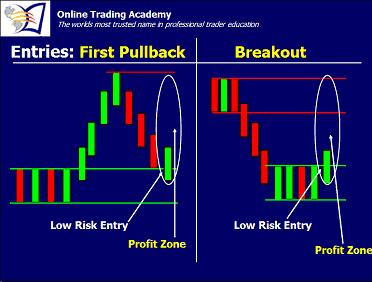
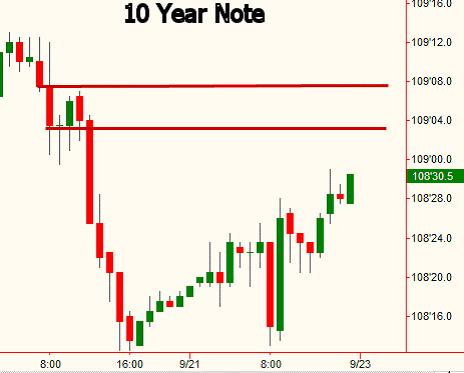
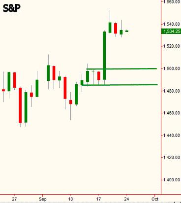
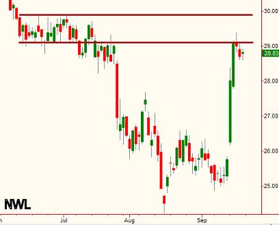
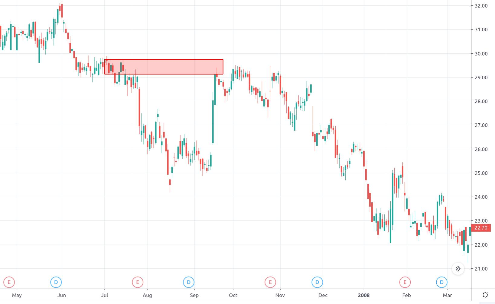
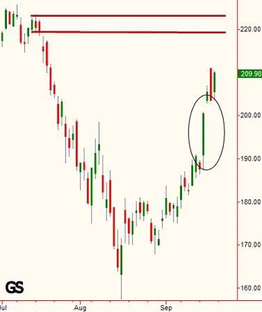

## 交易成功的一个关键因素

尽管我以前讲过入场，但我收到的很多邮件都跟入场有关系，所以今天再复习一下这个话题。“盈利空间”是指我们客观分析得出一个交易的盈利潜能。我们通过计算支撑和阻力位之间的距离得出盈利空间。上图中，盈利空间指椭圆圈中的地方。决定一个交易是否值得做的重要因素是，有没有足够的盈利空间？看看图的左边就知道了。当你要买入时，确保左边供应区在上方较远处。当你做空时，确保左边的需求区足够低。多远呢？对我来说，第一个止盈目标至少是止损目标的3倍。也就是说，我在找的第一个目标盈亏比至少为3的机会。

大多数时候，价格会超出第一个目标，但是盈亏比为3的机会，已经对你有利可以开始交易了。

你需要确保支撑和阻力位的准确性，保证盈利空间是可靠的。一个失败的交易者是那些开单前不做调查，在供大于求的阻力带4$买入，结果发现市场只愿出3$。这种事情，市场上每天都在重演。超级简单，但绝大多数人被为了赚钱掩盖真相的人呈现的假象蒙蔽，被玩的团团转。

我们再复习一下我最喜欢的一个市场，10年期权。我喜欢它是因为它交易量大，盈利空间大。注意看上图红线标注的供应(阻力)区。此处非常理想，因为当初从这里下跌的势头猛烈，暗示此处供需严重失衡。这意味着如果价格再回到这个位置，很可能快速下跌。我在一些课上也说过，应该关注最初是如何跌破那个价位的。如果你不明白也没关系，将来有一整节课会讲这个话题。跌下去再涨上来这个过程向我们展示了盈利空间的概念。交易者可以在供应区开空，因为第一个止盈位盈亏比大于3。

上图S&P的支撑在下面不远处。涨破这个价位势头很强，所以我们可以等价格首次回调到这个位置时开个单子。然而这个位置有一个问题，就是成功率不太高。从更大局面看，这个价位在供需曲线的位置不够好。因此，日单可能会从此弹向高处，但在此波段交易不太合适。

NWL最近到了阻力位。涨势大并不总是好事儿，没有筑基强势上涨到这个位置确实看起来像个机会。股票交易量还凑合，可以抱着学习的心态看一下吧。阻力位的买家买在了大涨后供应大于需求的地方。根据供需法则，只有不能持续赚钱的人才会做出这种事情，我们可以跟他反方向操作，看看会发生什么。

<del>译者注：上图是NWL2007年9月到阻力位后的走势。作者没错，虽然看着涨势猛烈，但还是没有突破阻力</del>

Goldman Sachs从8月触底后开始反弹，注意看，在持续上涨几天**后**，有个向上的缺口。关键词是**后**。能够不断盈利的交易者不会在此进场，因此我们可以归结为韭菜来了。如果价格到达供应区，我们将卖给那些在大幅上涨在此买入的人。
