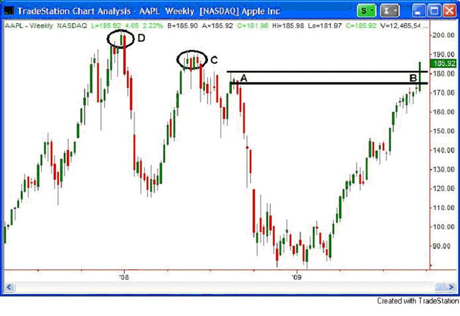
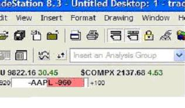
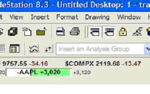
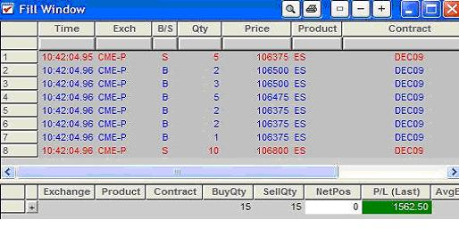

## 输赢一念间

### 我是赢家

我一直都很喜欢运动，热爱参与冰球、足球、高尔夫球和网球比赛。我的冰球水平达到了可以持续获胜的水平。联盟中有些团队总是获胜，有些总是失败。当我们与常常失败的团队比赛时，有时候他们会领先我们，但是我不怎么担心。虽然短暂落后，但我知道成功终究属于我们。这就是我们的态度。大多数时候，不管比赛中我们落后多少，最终都能反超取胜。失败者在态度上就已经输了。胜者只有一个想法，那就是“赢”，败者也有一个想法，“别输”。后者缺乏自信总是害怕，是他们持续失败的原因。

像大多数人一样，我也爱玩高尔夫球。有个童年伙伴常跟我玩。我们的技术不相上下，但我总能获胜。当他有个球打得非常烂的时候，他的内心无法平复。一次没打好对他有那么大的影响，剩下的比赛对他来说简直就是灾难。我有时候也打不好，谁都会这样。不同之处在于，这次打不好不会影响我下一次的发挥。我知道偶尔打烂球很正常，但这不影响整个比赛的成功。我的朋友只要一次没打好，就完蛋了，游戏结束，我已经赢了。

### 我喜欢胜利，痛恨失败

从小到大在运动中取得那么多成功，让我感觉自己似乎战无不胜。不管做什么，根本没有失败这个选择或想法。所以，当我刚开始交易时，有人告诉想要成功要先习惯失败，你能想象我有多么震惊吗！哈哈，简直就是笑话……我不可能失败，因为我很少失败，也痛恨失败。但没多久我就发现这是真的，我败了并且难以扭转。当我尝试减少失败时，成功也跟着减少了。这种感觉很糟糕。慢慢的，我从经验和一位朋友那儿找到了交易的秘密。这完全取决于你对失败的定义。在我刚尝试交易时，我对失败的定义是错误的。

### 感觉决定一切

想象你在生活其它方面遇到的挫败，经济、人际关系、升职等等。难道它们没有让你变得更强更好吗？在我看来，失败是取胜的必经之路。如我们在线交易学院创办者Eyal Shahar所说，“生活全在感知”。这句话我耳朵都听出茧子来了，但他是对的……关键在于看待问题的方式，如果我把每一单交易的损失都看作失败，我绝对干不好这件事；我无法容忍失败！然而，如果我把每次交易的损失在成功中找到合适的位置，刹那间，交易损失成了成功的必然。

### Apple Inc.(AAPL)

在XLT课堂上，我在主持的会议上为大家指出Apple股票中的一个交易机会。我把各种让我得出这个结论的因素分析了一下，一切似乎都很合理。

我说图中A处似乎是阻力位，应该会有一些卖家。等价格在B处涨到这个位置时，我有兴趣开空。XLT的300来个听众中有些人问我C处是什么情况。我说那也是一个供应区，不过到达那里需要先经过A。在B处，碰到线后确实有所下跌，有一点利润。几天后，难以置信的事发生了，股票击穿阻力位打到了止损。我怎么可能出错呢？我怎么看待这次损失呢？我的交易计划有什么问题？我最好还是找在线交易学院的老师问个明白，搞懂我错在哪里了。

如果你有上面的疑问，那说明你的心态已经败了。损失应该可以忽略不计，只占你账户一丁点比例。你的仓位也应该小到可以接受其损失。你应该确保这个损失，是你能够承受的最大的风险，很容易接受。在我的一个低风险账户里，我把损失控制在1000美元以下。我们可以看看：

这是AAPL止盈止损的窗口，如果960美元对你来说很恐怖，那么这对你来说就是特别大的风险。如果损失让你生气或惶恐不安，那说明你对损失的态度需要调整，应该改变你的态度。止损之后，我们继续前行。尽管A代表的供需不平衡通常会让价格反转，但这个位置的供应量没我想象的大。当价格跨越A区后，很快就到了供应区C。按照我使用规则制定的策略，此处还是应该开空。

当价格接近那个位置时，有很多空单；供应大于需求。价格很快反转，并且到了盈亏比为3的地方。基于规则，保护性止损移动到开单处，这意味着我们可以稳赚不赔。这一单有利可图。如果我因为第一单的损失而一蹶不振，那么因为害怕犯错就会失去第二单所获的盈利。

我在写此文时，在S&P期货又看到一些交易机会。交易时不担心损失，因为这不是失败，而是成功，所以我下单了。

上图是我用来演示的一个期货交易账户，真金白银，不是仿真。那天结束，账户上因为会议中的两单获利1562.5美元。那天开了两单，一赔一赚。像拉斯维加斯一样，我不关心那天成功率只有50%，我知道只要按规则办事，我的策略利润丰厚，风险管理也很合理，只有接受损失才能获利。当你改变自己的态度，理解这点之后，失败和成功没有了界限。这一天，两个交易中第一个是失败的。就像AAPL,如果这点亏损就把你击败了，或者让你认为自己错了，或者因为害怕和失败而瘫倒了，你将不再执行自己的计划，永远看不到利润。

根据我的经验，增加你胜率的规则并不是多么复杂。课堂上我每周都反复讲述这些规则，这很简单。难的是扭转人们对损失的态度，从成功者的角度来看待。我遇到的很多人认为我跟其它老师很少失算。他们上课是因为他们想学习交易中永不失败的秘籍。我们虽然胜率很高，但我们也会失算。谁都不愿失败，在体育运动中我深有体会。可是，就像运动一样，想要划的更快，练习中摔倒是必然的。如果您要进入大型联赛，那么通过更快的球技脱颖而出非常重要。如果您要直击300码的距离，则必须加大挥杆动作并切球100次。

如果赌场试图消除损失，将会发生什么？他们将倒闭，我们在沙漠中将失去一个游乐场。只要是适当的亏损，这个损失就很伟大。要成为专业的赢家，你首先必须成为专业的输家。很多人在市场投资失败了，因为他们从未克服这个障碍。少数能够正确认识损失的投资者会从那些不能正确认识的人手中赚到了钱。如果你想改变，请改变对损失的看法。

