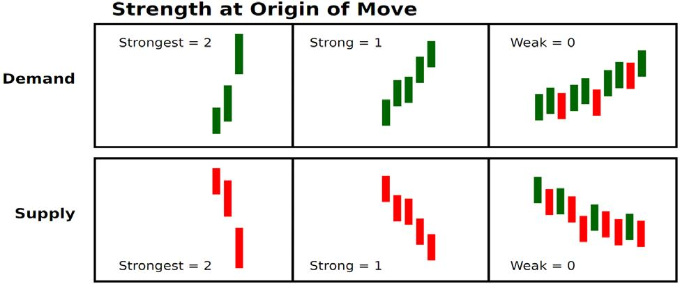

## 增加胜率的因素

### 势头(2分)

价格是如何离开这个位置的：非常迅猛，还是循序渐进。找到此价位供需不平衡程度的线索。在某个价位出现最强烈的反转说明供需严重失衡，价格离开价位的速度，可以反映这个价位供需不平衡的程度。价格变得越快，失衡越严重。

### 盈亏比(2分)

 1. 在价格重返需求区时，向上涨了多远，这可以算做第一个止盈目标。
 2. 如果在支撑/需求位买入，距离最近的供应区有多远。如果交易要拿20分冒险，最近的供应区有60多分远吗？如果没有，那我们对这个交易不感兴趣。

支撑/需求位很多，我们只选最好的那些。

### 大局(2分)

看一下日线，Sam做的大多数交易都是日内，但是为了在大局上占优势，他会看一下日线。原因如下：

 1. 大趋势的涨跌决定了我们想要做的方向。
 2. 更大的支撑和需求位在哪儿？我们不想在需求位上开空。只有通过大局，我们才能看清这一点。

如果我们在大趋势是下跌的背景下在小的时间框架做空，可以获得2分。如果我们在大趋势在上涨的情况下做空，并且接近大的支撑，那就是0或1分。

### 回调/测试(2分)

这根一般人的常识不太一样。如果价格离开一个价位，有很多回调测试阻力/支撑，我们希望在第一次进场，这是成功率最高的。第一次是2分，第二次1分，第三次0分。

这就像物体运动中撞到障碍一样，障碍是供应和需求处的一大堆订单。

就像砍树一样：每一次回调都会减少一些阻力/支撑，回调次数越多，越有可能通过。

### 在价位停留时间(1分)

跟第一项势头有重叠。在供需不平衡的位置，价格停留时间最短。教科书上讲得正好相反。

在价格失衡的价位，价格停留时间最短：很少的蜡烛。

如果价格平衡，就会停留很长时间。横盘期间，我们不想交易。我们只做刺激的行情。

在什么时间框架下多少蜡烛算少呢？千万别统计具体数字。改变时间框架会改变蜡烛数字。在你所看的时间框架下，比较蜡烛数量在不同价位停留的时间，别在具体数字上浪费时间。

### 到来(1分)

价格是怎么到达这个位置的。我们不想在其它位置附近。例如在买入前遇到新的阻力，或者卖出前形成新的支撑。强势归来意味着强势离开此价位。

### 满分：

 * 8分以上可以考虑进场

下面是不同分数下的做法：

 - [ ] 如果9分或10分，可开限价单
 - [ ] 8分可以进场
 - [ ] 7分及之下不交易

 - 另一个对短线交易者有利的因素是：发现机会的时间，在一天最开始45分到1小时内，通常会有黄金机遇。当天剩下的时间一般都没那么好。
 - 机构那边的交易，因为你可以看到订单流。一天内特定时间可以增加几率，是因为在所有市场，开盘或者接近开盘是供需最不平衡的。我每天都可以看到。考虑到这个因素，如果你擅于选择阻力/支撑和转折点，利润将会非常可观。最好的日内交易者在一天第一个小时把当天的钱给赚了。我不认识只在下午交易能够赚钱的人。如果下午开单，错过早上的好机会，赚钱更难。因为所有订单处理之后，一般供需又会恢复平衡。
 - 如果你不知道自己在干什么，别在开盘时交易。但如果你明白，那就做吧，绝大多数资产再分配都发生在这个时候。

一日之**机**在于晨。

### 注意事项

 - 供应区：涨、横、跌
 - 需求区：跌、横、涨

如何在不冒太大风险的情况下跟随上涨的大趋势。

 - 如果处于涨势，在回调到坚实支撑买入
 - 在下跌趋势，因为市场一边筑基一边下跌，在向上回调时反方向开空
 - 横盘时，在涨到供应区时卖出，跌到需求区买入

对于期货市场交易的人来说，这些很重要：

 - 价格涨到一个价位次数越多，交易机会越多，越有可能反转。
 - 抛售后专注于市场交易范围的四个阶段的趋势
    1. 积累：抛售后，机构开始吸筹，散户恐慌抛售。机构为下一阶段储蓄力量
    2. 上升：价格上涨，然后在一个区间交易，不再那么疯狂，机构在高处抛给散户，边涨边卖，各种插针，让散户退出
    3. 顶峰：
    4. 下跌：难看的下跌

大格局(月线、周线、日线、时线、5分钟线)，从大的时间框架往下看。有两个原因：

 - 找到大的支撑和阻力位
 - 发现大的趋势

我们在XLT不会从蜡烛中间划线。我们希望实时看到供需的变化。很多人会让阻力支撑线穿过蜡烛。

进场 - 懂得何时反转是关键。

 - 交易的难题是进场。当你认为自己的目标或者止损有问题时，通常是因为你选择的进场时机不对。
 - 进场的3种方式
   1. 限价进场
   2. 确认后进场
   3. 突破进场

决定我们使用哪种方式进场的原因是什么呢？

 - 全看增强胜率的因素
   - 专注于增强胜率的第一点：势头。这可以帮助我们理解要选哪种入场方式。十分机械化。
   - 确认后入场。价格进入某个价格区间，我们在离开时买入。如果击穿到另一边，则取消交易。
   - 很多人等确认后入场，那是因为离开价位的时间不够快。XLT的成员从来不在确认后入场，因为他们只想把握非常难得的机会。
 - 确认 - 制作一个规则，可以是价位外的0.01、0.05或0.10分。也可以在区间内触发。最重要的是，这是一个规则。如果在区间外0.10使得盈亏比不满足条件，那就不去做。
 - 没有完美的答案，也没有完美的规则。最重要的是你要设置规则，并且要有所依据。
 - 我们想要在供不应求的低谷的价位买入。

如何进场：

 - 如果价格深入区间，触发进场价，做好在离开前买入的准备。如果已经打到止损，则取消交易，不再入场。尽可能的机械化。
 - 在供应/阻力位入场，价格触发入场价，在离开此区间时开空。只有在*确认后交易*不这么做。如果价格穿过阻力带，打到止损，那就取消交易。进场后，除非打到止损，或者止盈，中间你都绝不要干涉。

