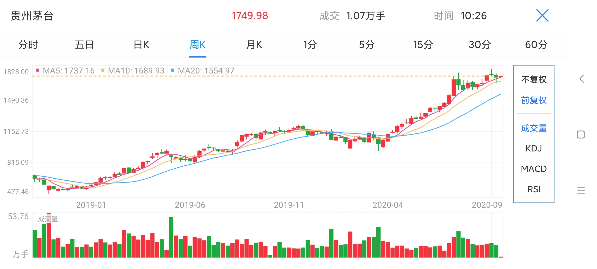

## Set it And Forget It(125页)

我们天生就不适合交易。我们本能的逃离可怕的事物，亲近美好的事物。如果交易时还是如此，你肯定会碰到大麻烦，因为在交易的世界里这意味着失败。例如，你只在上涨趋势明确、所有指标都指向上方、新闻对于市场有利才愿意买入，你认为现在的价格在哪儿呢？很可能是非常高的位置。在此处买入完全违背了你低买高卖的目的，风险非常之大。别忘了，只有更多人在你之后更高的价位买入你才有可能赚钱。想要在别人之前从风险较低的位置入场，大多数时候你要在下跌趋势末端，指标指向更低处，新闻很不利时入场。这跟人的本性正好相反。

我从前讲过，我们天生就不适合交易。那种行为/信仰体系在多年学习传统金融/经济的过程中被强化了。例如，大多数关于市场的课程告诉我们，进入市场之前要多做研究。通常要确保这家公司利润丰厚、管理完善、行业领先、股价处于上涨趋势。我再问你一遍，当所有这些都满足时，你认为股价在哪里？十有八九，股价已经过高了，此时进场相当于给在你之前买入的人送钱。

在我看来，想要在交易这个职业取得成功，需要具备两种品质：

 - 你必须深刻理解市场运作原理，并根据供需法则制定基于规则的策略。交易/投资相关的教育培训行业缺乏监管，很多人从擅长营销推广而不是擅长交易的人那里学到了完全错误的理论。这会让80%的投资者赔钱，因为他们完全没搞懂市场是怎么工作的，被培训课程和新闻蛊惑的高买低卖。这条充满滞后的指标、振荡指标和常规技术分析的歧路将带领人们作出高风险、低回报的交易。

 - 你必须自律，严格按照基于规则的策略行事。在剩余20%学到真本事的交易者中，缺乏自律让他们中的80%无法取得成功。

在你因为此文过度消极把它扔到一边之前，请坐好接着看下去，希望就在眼前……

我是XLT在线交易学院直播课堂中顶级的期货/外汇课程的交易员和培训师。我有多年投资股票、期货、外汇、期权的经验，在XLT教过很多新手，我发现太多人不具备上面两种品质。我们重温一下最近在一些XLT课程中的交易，希望你能更加深刻的理解市场运作原理。之后我会向你展示我们是如何解决对于新手来说很有难度的自律问题的。

这是NASDAQ(S&P)非常平凡的两个我们提前计划并执行的交易日。在开盘前，我们只是标记好上个交易日的需求(支撑)位。同时，我们在上面标记好供应(阻力)位。股市开盘后，我们非常乐意在降价后，在提前计划好的需求区从别人受理购买。这个位置风险低、回报高、成交概率更大。

供需法则一再证明卖家在价格降到需求区后卖出往往会赔钱，因此我们根据自己的策略，站在卖家对立面，从消息不灵通的卖家手里买入。然后，等价格涨到我们预设的供应区上后，一些XLT交易员平多开空。我们卖给了谁？我们卖给了总是犯犯同样错误的卖家和买家。首先，他们在大涨后买入，只是错误一。其次，他们买在一个图表显示供应超过需求(卖家多于买家)的区域。为何有人会在这个价位买入？他们买是因为看到了好新闻，大牛市已经来了，当然也有人本能会让他们看着别人都在买时也会跟着买的因素。

上图是原油期货。我们首先确认需求区，在图中画上线，计划我们的交易。注意到价格如何到达我们的需求区。下跌严重超出我们的入场价，价格跌得很厉害，应该是有什么坏新闻，以及不利指标。大多数交易员和投资者在价格下跌后会抛售，尤其是像上面原油跌这么厉害。这种行情对于新交易员来说在需求区按下买入键是非常可怕的。

