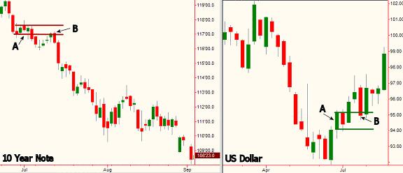

## 从真实价值的角度谈美元

我已经有超过15年交易和写作的经验了。我写的大部分文章都适用于在不同市场和话题中根据供需原理找到真正的价值。我通常使用纯粹的供求关系动态变化来试图揭示全球市场上的各种幻象以及价格变动。如何识别、量化、并从供需失衡中确认价值是我工作的主要目的。考虑到我会收到一些不那么友善的邮件，为什么要花所有的时间揭露幻象并与敏感的主题打交道呢？ 因为一旦我们识破幻像，便能发现真相。

地球上正在酝酿着一场没有硝烟的战争。这是一场最有趣的战斗，很可能会改变未来全球金融领域的主角。一方很高兴能参加这场战斗，而另一方甚至没有意识到自己正处于一场大战中。双方如下：

 - **世界上的制造者和储蓄者**
    - 东亚，中国，日本
    - OPEC Hydrocarbon Exporters

 - **世界上的消费者和借贷者**
    - 美国政府和美国人民

2006年，美国有超过8000亿美元贸易逆差。我们美国人每天要向世界上的储蓄者借20亿美元，他们指望我们将来还钱。换个角度讲，我们借了世界上80%的储蓄才过上了这种奢华的生活。我们只有5%的人口却消费了世界上30%的产品。我们这么做的一种手段是把我们家当成取款机。辛勤劳作的亚洲人和石油产出国消费的远少于他们的产出。美国人却正好相反，生产的远没有消费的多。然而，储蓄者和消费者也能达成共识。劳动者很高兴接收美元，消费者更愿意印美元。明显的问题是，这种情况无法永远持续下去，否则外国公司将拥有我们的所有财富。当我们从各种取款机提钱时，相当于把钱存到了世界各地生产者和储蓄者的存款机里了。当我们取款机没钱后，我们需要迎接生活方式巨大的改变。

大多数美国人了解这个问题，但是他们没有意识到有两个因素加速了我们在对抗金融冲突战斗的失败。首先，他们被股市的财富和购买力蒙蔽了双眼。其次，很少有美国人关心美元自由落体式的贬值，因为他们不懂美元。美元在过去五年已经载了跟头，并且很可能持续下跌。谈起全球金融市场的幻象，我们又谈到了价值的本质和幻象。跟交易类似，看透价值本质的人能够从看到价格幻象的人手中赚到钱。

### Dow财富幻象

当你收到投资经纪人每月的报表时，有没有因为看到Dow一月又一月的创新高让资产不断升值而微笑呢？这种财富增长是非常典型的一种幻象，因为你忽略了报表上缺失的一个非常重要的数据，那就是考虑美元全球购买力缩水后Dow的真实价值。美国大众看到的所谓的Dow价值是虚幻的。我们研究下Dow真实的价值，我们把你在月度报表上看到的名义价值乘以美元交易权重指数。在此之前，请做好被现实击垮的心理准备。2000年，Dow最高为11700点乘以美元指数1.24等于14508点全球购买力(Global Purchasing Power Parity)。在2007年，Dow高达13500乘以美元指数0.81等于10935点全球购买力。14508-10935=3573点除以14508=25%的真实股市缩水！

尽管最近Dow在美元暴跌后创新高到14000点，但现在比它2000年11700点时少买超过30%的欧元。少买35%牛奶，40%的玉米或小麦，65%的白银，70%的原油……简单算一下就知道Dow现在可以买多少房子、保险、付多少学费、医药费。不管你怎么计算，大多数美国人心中非常有价值的Dow真实价值远低于其在2000年一月的价值。纳斯达克真实价值又如何呢？我们算一下：

 - NASDAQ 2000年高点：5000
 - 美元加权指数：1.24
 - 5000×1.24=6200pts

---

 - NASDAQ 2006:2500
 - 美元加权指数：0.81
 - 2500×0.81=2100pts

(6200-2100)÷6200≈0.66，从真实价值的角度看，跌去了66%，这就是现实！

### 理解美元

美元是基于信用的货币，我们现在生活的货币体系是一种新的规划。1971年以前，美元与黄金挂钩。如果你是中央银行，别人花35美元就可以从你这儿买一盎司黄金。这个系统在美国把金条用完之前都挺好。1971年8月15日，尼克松总统不再让美元与黄金挂钩，汇率开始波动，政府一路以来不断修补，直到今天也是如此。

我在汇市也有15年了。对普通人来说，有一种方法，可以更简单的理解货币相对涨跌的过程和原因，那就是把它们当作可以公开交易的公司。例如，涨势坚挺的公司股票需求量往往非常高。有一些像几年前的Enron的一样暗中操纵的公司，当大家明白这是巨大骗局之后，所有人都卖掉了终究要归零的股票，这家公司也破产了。

Enron诈骗的主要责任人结局如何呢？一个被判长期监禁，另一个庭审过程中死于心脏病。Enron幻象无非就是把危险伪装成机遇。货币的价值也是如此。增长率和高利率会让全球投资者购买此国的货币，这将推动货币的升值。货币价值越高，此国真实全球购买力指数就会越强。如果美国和美元是一家可以公开交易的公司，我们更像Enron而不是微软。世界制造者和储蓄者的货币更像微软。全球货币都在寻找安全高回报的投资，几年来汇市一直告诉我们，美元并不属于这个类型。

### 用黄金来衡量价值

黄金作为世界上的货币已经有2000年了。在1932年，人们花20美元可以买一件不错的西装。当时我们处于金本位制度，1920年一盎司黄金价值21美元。现在，一条像样的领带都要不止20美元，别提西装了。然而一盎司黄金仍然可以买一身不错的西装。黄金保持了它的价值；现在一盎司黄金超过700美元，足够买西装了。

### 黄金和纸币

滥印纸币导致通货膨胀，进而导致更高的利率，高利率不利于债市，弱的债市又不利于股市。这是过去120年我们走过的路。

### 黄金和Dow

多少黄金可以买下Dow？想一下，在2000年，Dow为11700点，黄金250$/盎司。Dow除以金价，比率为47:1。2007年，Dow为14000点，黄金740$/盎司。此时Dow/金价比率为19:1。Dow变了吗？没有，它是30个股票的指数。黄金变了吗？也没有，它是惰性元素。只有美元对不同资产的购买力变了。不要说*Dow价格有多高*，而要看*Dow的真实价值如何*。这种说法跟你从传统媒体那边听到的完全不同。Dow每次创新高人们都会在电视上狂欢，他们为何避而不谈我们此处谈论的问题？很简单，当你看到Dow真实价值不仅没涨还在下跌时，你狂欢不起来。

<del>我不认同作者此处的观点，黄金只是因为稀缺才拿来衡量资产的。股市上升是因为很多公司创造了价值，满足了人们的需求。相比2011年，这些年黄金价格一直没什么变化，Dow/黄金却大了很多。作者应该是在2008年特殊时期写的文章</del>

### 一种客观及时的解决方案

现在真是乱糟糟的，我们如何补救，我们学到了什么，未来如何预防这类情况？有个答案一下子回答了这三个问题。客观供需分析能确保你找到价值所在。不论你是否要进入债市、汇市、黄金，都有必要了解这些市场的供需关系，这关系到你的切身利益。如果你在银行有积蓄，很有必要学习如何阅读美元图。如果你家有抵押，那你在市场就有仓位，应该学着看懂10年债券市场图上的供需。如果你以前从没看过这种图表，可能会被这种想法吓到。别害怕，没你想的那么难。

上图两个A部区域代表短暂的价格稳定，给人一种供需达到平衡的感觉。从A部下跌告诉我们此处美元供应超出需求。初次下跌只会发生在A处供需失衡的情况下。也就是说此处卖家很多。因此当价格重回到A所在的价位B处时，我们可以说价格重返供大于求的B区。在所有市场，当价格到达供大于求的地方时，价格下跌。当美元指数下跌时，美国全球购买力指数也跟着下跌。在此例中，第一次从A处下跌让人惊心动魄，这说明此处供需严重失衡，也意味着我们可以在B处看到类似的下跌。观察市场发现有价值的事物非常简单，然而大多数人对眼前上演的游戏视而不见，因为那些靠掩盖真相大赚特赚的人为他们呈现了一种假象。

上图左边是10年债券，右边是同期美元指数。货币最明显的特征是高汇率。我们看看左边的图，A处同样代表供大于求。我们知道这个是因为只有A处卖家多于买家价格才会下跌。第一次重返A处价位是在B处，如我们预料，价格从此处开始下跌。当资产价格下跌时，利率上升，价格与收益的关系是相反的。

我们再看右图，A处短暂的价格稳定给人一种供需平衡的感觉。A处价格上涨说明A处需求强盛。初次上涨是因为此处供需失衡，也就是说此处买家多于卖家。因此，当价格第一次跌落回A位到达B处时，我们可以认为价格又到了供不应求的区域。在所有市场，当价格供不应求时，价格上涨。当美元指数上涨时，美国全球购买力指数增加。我们把汇率变化和美元价值变化综合考虑。当汇率开始上升时，美元走高。记住，高汇率吸引外国人购买美元(增加需求)。如果你重视真实价值，避免幻象，那我们可以早早的看懂价格图表上曾一再演绎的戏剧。

### 价值的幻觉和幻化的价值

不论说金融市场长期的繁荣，食物的益处和风险，健康的人际关系，共同点在于发现真相和幻象。在金融市场，客观评估供需不仅帮你持续发现真的价值，也会帮你打开低风险高回报机遇的大门。你用什么来权衡你的资产？你的标准有真实价值吗？我的建议是，使用没有幻象的标准来判断你的全球购买力和财富。一丁点幻象都会阻挡你发现真相。

### 漫长熊市

从全球购买力的角度看，我们经历了2000年以来“Dow,Nasdaq,S&Q指数"漫长的熊市。美国并不是通过印钱和几乎无息贷款模式建立起来的，但一定可以被这种模式摧毁。如果我们不能维持全球购买力，我们的生活质量将极速下降。在很多方面，已经下降了。明白了吧，造化弄人，别被幻象蒙蔽真实的趋势，要看到这一种极可能改变你生活质量的现实趋势。

