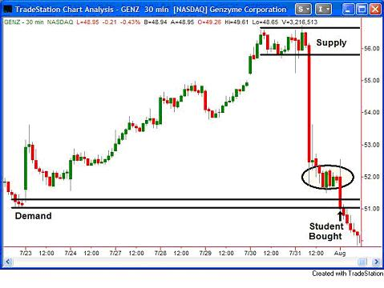

## 一些最常见问题的答案

这周我想要分享一些很多人都会遇到的一些重要问题。在一个充满误导性信息的行业中，找到正确的答案对于新手而言可能是艰巨的任务，因此，我将尽力正面解答一些最常见的问题。

**问题：需要多久我才能变成一个成功的投资人？**

从业多年，见过很多新手后，这个问题的答案变得非常清晰。通常，决定你多久才能持续盈利的是你受合理训练之前经验的多寡。作为一个老师，教育几乎没有经验的人是最容易的。这是因为他们没有被不良信息(漂浮在他们脑子里的亏钱“决策过滤器”)所毒害。参加很多研究会，阅读很多交易书的人反而很难达到他们的目标。

<del>译者评：大多数老师不懂得因材施教，对于所有人都想要用一种方法去教。此外，现实中很多人才不是培养出来的，而是自学出来的。我认为，看书，开一些小的单子试验，总结经验，找到适合自己的节奏，应该适合所有人，累积花的时间应该也差不多。</del>

关键问题是你要准备好学习如何合理的推断市场走势，及时获得准确的信息。这是关键，**因为对任何信息的第一印象是根深蒂固的。一旦被洗脑，需要花费很大功夫移除并换上合理的信息。**对于新手而言，找到合理的交易教程并没那么容易。如果你没有经验，如何能够加以判断呢？我的答案是使用简单的逻辑思考一下，如果信息过于复杂或者你无法理解，那很可能就是毒害你亏钱的信息。现在你应该已经知道如何合理买卖生活中的其它方面的东西了吧？如果你的答案是肯定的，那你已经是一个好的交易员了。你所需要的就是让别人教你如何看价格表，然后按照你的想法行动。

---

**邮件问题：**

你好，Sam

可以帮我看看附件中GENZ的图表吗？我有点困惑。今天，8月3号，开盘价51.99，我按照7月23号的需求位，打算在51.35开多，51.00止损。因为我认为这是一个好的需求位。

它是一个降级的股票，关于股票有一些坏消息。我通常不怎么看新闻，专注于图表。被止损后，我去看了看新闻，想知道为何会有这么多卖家，结果发现果然有坏消息。

我看了下让我买入的7月23号的价位，发现那边涨势迅猛，才决定在此入手。(可能翻译不准确)

>I looked for the drop base rally with a huge move out from that area which brought me to the July 23rd level.

我分析的正确吗？十分期待你的帮助！

---

邮件提到的错误非常常见，我们谈一下。供应/需求区是学生标注在图表上的。圆圈标注的地方是卖家集中地，学生没有注意到。

你好，感谢发邮件过来

 1. 从图中看起来，供应区并不是特别远，这限制了你可能的盈利，并且不远处的卖家对我们来说很不适合开多。
 2. 这是价格第三次到达这个价位，要特别注意。近期的涨势并不是那么强烈。结合上一点意味着胜率更低。
 3. S&P不在支撑位(需求区)。根据S&P来计划交易虽然不是最重要的但也值得注意。

这是一些增加胜率降低风险的想法。

Sam

---

**问题：关于交易有那些好书值得一读？**

如果我回答一遍这个问题别人就给我一美元，那我可能就不需要交易了。下面是我最直接(不流行)的答案。我认为，你所需要的关于市场运作以及何时买入卖出的所有知识都可以在两本书找到答案。第一本是高中或者大学的Economics 101，关于供需这本书讲得很透彻。其次，复习一下可能在你书架上靠近经济学类的那本布满灰尘的Psychology 101，这本书告诉你人思考的方式。尤其是大多数人是怎么作出决定的。对此，我在过去写了不少东西，但全都没超出你那本走出学校就再也没碰过的书的范畴。我可不是在开玩笑，看完记得告诉我你的想法。确实有一些不错的投资书，不过别误会，绝大多数都是只写书不交易的人写的。

看完这些书，回来Online Trading Academy找我们，我们将向你展示如何在价格图表看需求、供应、人的情绪。当你理解这个后，在所有市场中低风险，高回报，成功率高的机会将会非常明朗。

