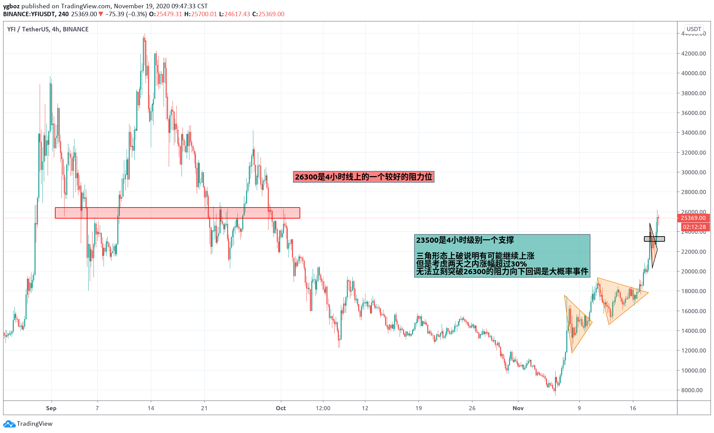

# 做空YFI

做空原因：YFI从7500涨到26190仅仅用了十多天时间，从18500涨到26190用了两天，昨天从20000涨到24880仅仅用了几个小时，之后开始大幅回调。考虑到涨到26190之前已经有了大幅度的整盘，所以不考虑长期的空单。26300是4小时级别的一个不错的阻力，15分k线图可以看到价格涨到26190后马上跌落到25200附近，说明上方供应远大于市场需求，所以我选择回调后在这里开个短期空单。

最开始设置25800开空，26400止损，24000止盈。但是切换到1小时k线时发现24500也算一个小支撑，价格跌到24600上方马上回弹到25000上去了。因为过去做空YFI成功率太低了，所以我把止盈放到24660，止损也相应的向下调整，整个单子用了不到一个小时就止盈了！

---

我不知道未来价格会向什么方向发展，价格涨的太快了，又遇到强阻，所以我更偏向于开空。我认为一天内有可能会到23500，一周内可能会落到20000到21000之间。
