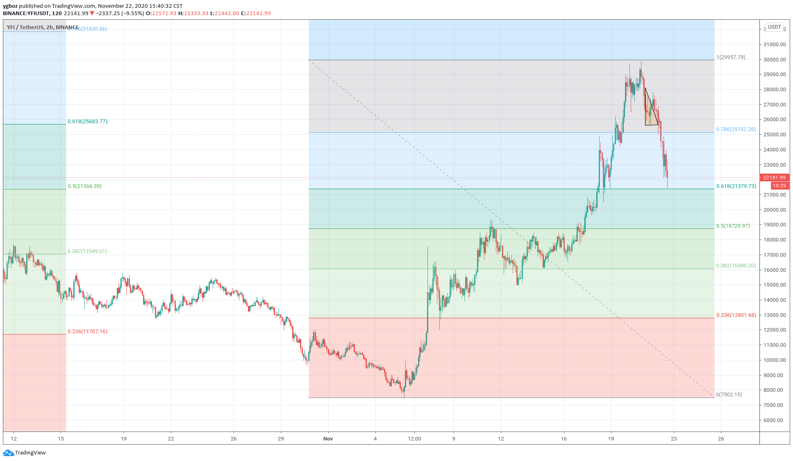

# ETH两个空单被止损，YFI多个多单被止损，XRP空单未入场

到三角形态底部开多，分阶段止盈，小赚一笔，然后等上破阻力后多次开多被止损。跌破三角形态底部后又多次开多，被止损。

以后不要急于入场，只在重要支撑入场，设置比较大的止损。

ETH多次开空被止损。最后一个空单我在555开空，562止损，520止盈，被止损后价格马上反转了。可能我止损设置的太短了，但我看563怎么也不像阻力。

累计亏损五六单，心态都不好了！以后不能频繁开单。

XRP原计划在0.49开空，但看到多单被止损，提高到0.498，错过了入场机会。今天除了现货，合约全部亏损。

以后ETH最好在557,568这样的位置开空单，XRP最好在0.39,0.48这样的位置开空。不要急着入场，也不要设置太小的止损，开完单就不再去关注。我想有可能ETH在550是个硬阻力，但是涨势太强，所以就给涨了上去，以后要考虑这种飞速上涨和缓慢上涨的情形。
