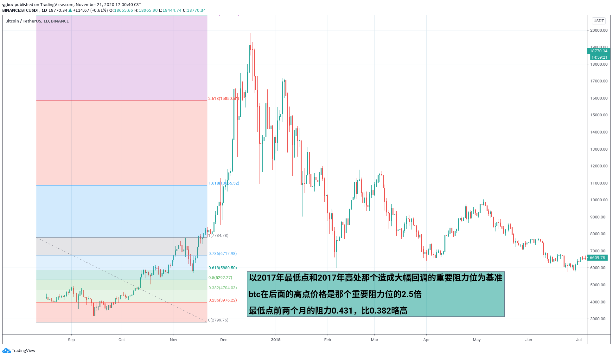
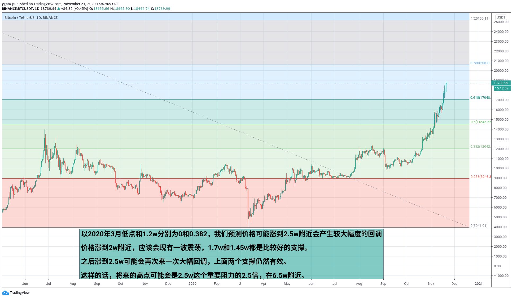

# 大概预测比特币的未来高点

以2017年最低点和2017年高处那个造成大幅回调的重要阻力位为基准，btc在后面的高点价格是那个重要阻力位的1.5倍。最低点前两个月的阻力0.431，比0.382略高。

以2020年3月低点和1.2w分别为0和0.382，我们预测价格可能涨到2.5w附近会产生较大幅度的回调。价格涨到2w附近，应该会现有一波震荡，1.7w和1.45w都是比较好的支撑。之后涨到2.5w可能会再次来一次大幅回调，上面两个支撑仍然有效。

这样的话，将来的高点可能会是2.5w这个重要阻力的2.5倍，在6.5w附近。

