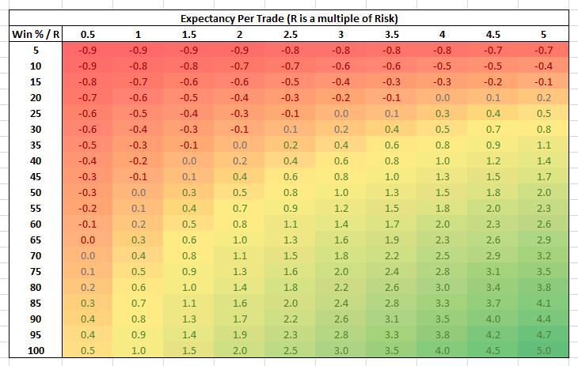

# 供应和需求

 - [A Key Factor for Trade Success(交易成功的重要因素)](Supply_and_Demand/A_Key_Factor_for_Trade_Success) p9

 - [The Dollar, In Real Money Terms(从真实价值的角度谈美元)](Supply_and_Demand/The_Dollar_In_Real_Money_Terms) p62

 - [Set it and forget it(开单然后忘掉它)](Supply_and_Demand/set-it-and-forget-it/) p125

 - [The Straight Answers to the Most Frequently Asked Questions(一些最常见问题的答案)](Supply_and_Demand/The_Straight_Answers_to_the_Most_Frequently_Asked_Questions) p198

 - [Losing to Win, It's All in Your Perception(输赢一念间)](Supply_and_Demand/Losing_to_Win/) p223

---

 - [使用Python计算止盈止损](scripts/)

