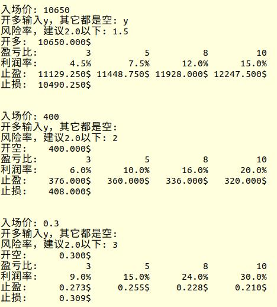

# 使用Python计算止盈止损

```py
#!/usr/bin/python3
while True:
	enter = float(input("入场价: "))
	isLong = input("开多输入y，其它都是空: ")
	risk = float(input("风险率，建议2.0以下: "))
	rr = [3,5,8,10]#Reward/Risk
	tp = []#Take Profit
	if isLong == "y":
		for i in rr:
			tp.append(enter*(1.0+i*risk*0.01))

		sl = enter*(1-0.01*risk)
		print("开多:  {:9.3f}$".format(enter))
	else:
		for i in rr:
			tp.append(enter*(1.0-i*risk*0.01))

		sl = enter*(1+0.01*risk)
		print("开空:  {:9.3f}$".format(enter))

	print("盈亏比:{:10d} {:10d} {:10d} {:10d}".format(rr[0],rr[1],rr[2],rr[3]))
	print("利润率:{:9.1f}% {:9.1f}% {:9.1f}% {:9.1f}%".format(rr[0]*risk,rr[1]*risk,rr[2]*risk,rr[3]*risk))
	print("止盈:  {:9.3f}$ {:9.3f}$ {:9.3f}$ {:9.3f}$".format(tp[0],tp[1],tp[2],tp[3]))
	print("止损:  {:9.3f}$\n\n".format(sl))
```


